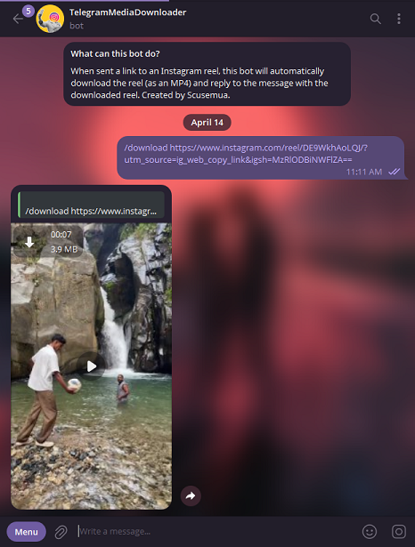

# 📥 Telegram Media Downloader Bot

A simple and lightweight **Telegram bot** that provides an interface to the [yt-dlp](https://github.com/yt-dlp/yt-dlp) Python module, enabling users to download **YouTube Shorts** and **Instagram Reels** directly within Telegram.

## 🚀 Features

- 🎥 Download **YouTube Shorts** by simply sending a link
- 📸 Download **Instagram Reels** from share links
- 🧠 Built using Python and [yt-dlp](https://github.com/yt-dlp/yt-dlp).
- 🤖 Clean Telegram Bot interface for ease of use

## 🛠 Requirements

- Python 3.8+
- Telegram Bot Token from [@BotFather](https://t.me/BotFather)

## 📦 Installation

1. **Clone the repository**
   ```bash
   git clone https://github.com/yourusername/telegram-media-downloader.git
   cd telegram-media-downloader

2. Create a virtual environment (optional but recommended)

```sh
python -m venv venv
source venv/bin/activate  # On Windows: venv\Scripts\activate
```

3. Install dependencies
``` sh
pip install .
```

or simply 
``` sh
pip install -r requirements.txt
```

4. Configuration (environmente variables)

Create a .env file in the root directory with the following required environment variable:
``` sh
TELEGRAM_BOT_TOKEN="<your_bot_token_here>"
```

The `TELEGRAM_BOT_TOKEN` is used to specify the [Telegram Bot Token](https://core.telegram.org/bots/api#authorizing-your-bot) for the bot.

Optionally, you may also specify a `CHAT_IDS` environment variable and a `BOT_PASSWORD` environment variable:
``` sh
TELEGRAM_BOT_TOKEN="<your_bot_token_here>"
BOT_PASSWORD="<bot_password_here>"
CHAT_IDS="000000001,000000002,000000003"
BOT_USER_ID="0123456789"
```

The `BOT_PASSWORD` is an optional password that, when specified, will prevent the bot from responding to links from chats that haven't been authenticated.

To authenticate a chat, use the `/auth <bot_password>` command in the Telegram chat.

The `CHAT_IDS` environment variable enables you to "pre-authenticate" some Telegram group chats/private message chats that will work immediately, without having to first use the bot's `/auth <bot_password>` command.

The `BOT_USER_ID` environment variable is used to inform the bot of its own Telegram user ID. This is used so that the bot can detect when it has been added to a new Telegram group chat. This initiates a countdown timer. If the chat is not authenticated using the `/auth` command before the timer expires, then the bot will leave the group chat. This is performed so that the bot is not overwhelmed by messages from unauthenticated group chats.

**Note:** these arguments can also be passed as command line arguments. For a description of the available command line arguments, execute the following:
``` shell
python -m telegram_media_downloader_bot --help 
```

## Additional Configuration

You may set the `ADMIN_USER_ID` to your Telegram user ID to enable access to various admin-only commands.

# ▶️ Usage

Start the bot with:
``` sh
python -m telegram_media_downloader_bot
```

Then, open Telegram, find your bot, and send a YouTube Shorts or Instagram Reels link. The bot will reply with the downloadable video.



## User Commands

- `/download <URL>`: Download the media at the specified URL and reply with the attached video. Works for Instagram reels and YouTube shorts.
- `/metrics`: Send a message with the total number of downloads performed by the bot.
- `/auth <password>`: Authenticate the chat in which the command was sent.
- `/auth <chat_id> <password>`: Authenticate the specified chat (not the chat in which the command was sent).

### Inline Commands

You may also perform *inline downloads*. You must first execute the `/start` command in a private chat with the bot. Once that is complete, you can simply type `@<BotUsername> <URL>` in any chat. The bot will download the video, send it to you privately so that the video is available with a unique ID on Telegram's servers, and then display a pop-up button that allows you to send that video to the currently-active Telegram chat. The message sent to you privately will be automatically removed after a few seconds.

This enables you to convert, download, and send reels and shorts without having to send the link at all.

## Admin Commands

The following commands are only available to the admin user (i.e., the user whose Telegram ID is specified via the `ADMIN_USER_ID` environment variable).

- `/exit`: If executed by the admin user (who can be specified via the `ADMIN_USER_ID` environment variable), then the bot server will terminate/exit.
- `/clear_auth`: Clear all authenticated users and group chats, then re-authenticate the configured "pre-authenticated" chat IDs.

# 📁 Project Structure

``` 
telegram-media-downloader/
├── telegram_media_downloader_bot/  # Main Python module.
   ├── __init__.py                  # Module declaration.
   ├── __main__.py                  # Entrypoint.
   ├── bot.py                       # Main Telegram bot logic.
├── requirements.txt       # Python dependencies.
├── pyproject.toml         # Module configuration file.
├── .gitignore             # .gitignore file.
├── .env                   # Bot configuration (not tracked).
├── sample-env             # Sample bot configuration file.
└── README.md              # This file.
```

# ✅ Supported URLs
- https://www.youtube.com/shorts/<video_id>
- https://www.instagram.com/reel/<reel_id>
- https://www.instagram.com/p/<reel_id>

# 🔒 Disclaimer
This project is for educational purposes only. Downloading content from YouTube or Instagram may violate their terms of service. Use responsibly.

# 📄 License
MIT License